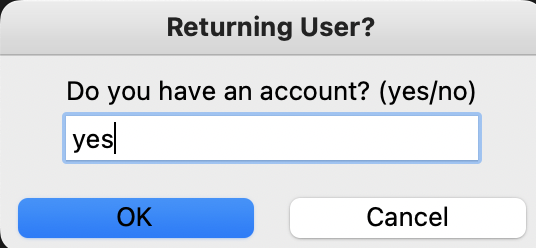
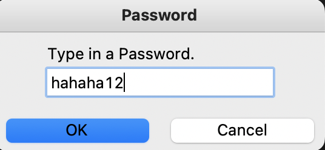

# cs262-wire-protocol: WiredIN

Aakash Mishra (aakamishra, amishra@college.harvard.edu), Rajat Mittal (greenFantasy, rajatmittal@college.harvard.edu)

## A Socket-Based and GRPC Based Simple Account-Managed Chat Server. 

## Installation Instructions

Download the repository from Github.

```
git clone https://github.com/greenFantasy/cs262-wire-protocol.git
```

Click below for instructions on how to install the required modules.
[Python Module Installation](docs/install.md)

## Design Document

Below is our Chat Server design document.

[Chat Server Design](docs/design.md)

## Engineering Notebook

Below is the notebook we used to keep track of our notes.

[Engineering Notebook](docs/notebook.md)

## Unit Testing Documentation

Below is the documentation for our unit tests.

[Unit Testing](docs/testing.md)

## Running the Client

In order to run the server open a bash / terminal on your computer and simply invoke the following:

For GRPC.

```
python grpc_server.py
```

For Sockets.

```
python socket_server.py
```

In another bash / terminal window run `python client.py`.

The terminal prompt will ask you for (y/n) for GRPC. Please type in "y" and then <enter> if you activated the GRPC server, or "n" & <enter> if you activated the socket server.

If you have made an account before (as in within the instance of the server running) then please type in yes. However, if it is your first time booting up the client then enter no. 



Then enter your username:


You can then chose an appropriate password.



Finally add your name to complete the instance profile.


This will intialize the chat window for you as follows:

#TODO Aakash


