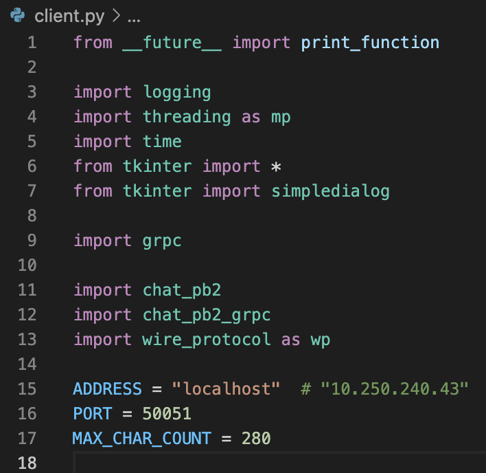
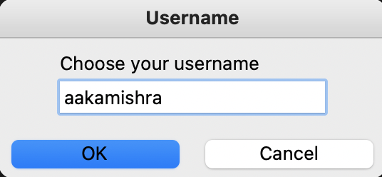
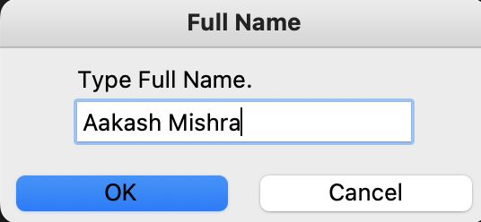
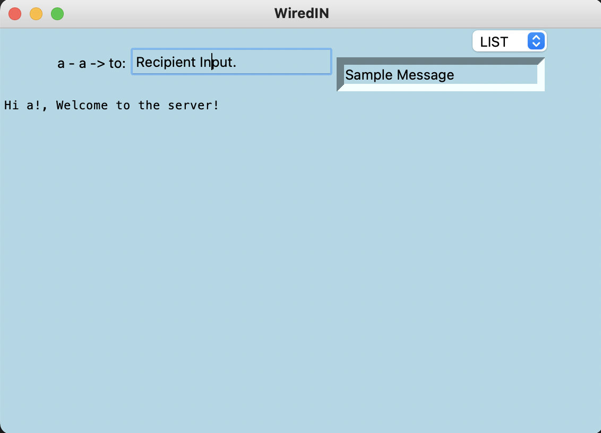
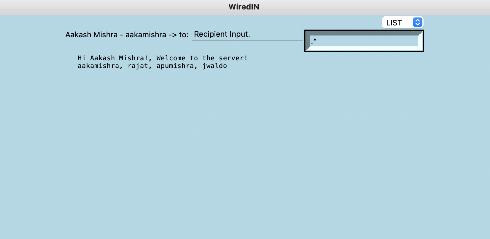
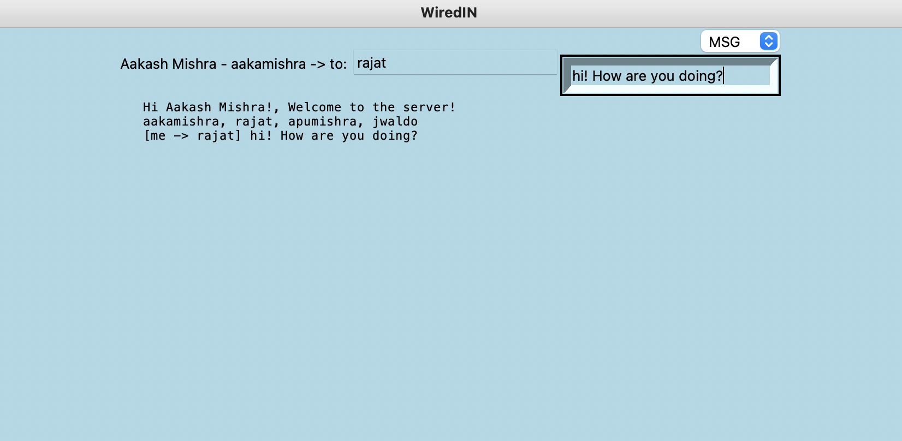
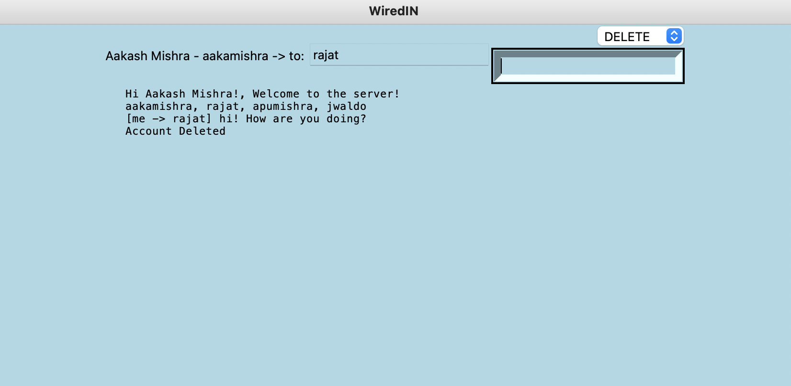
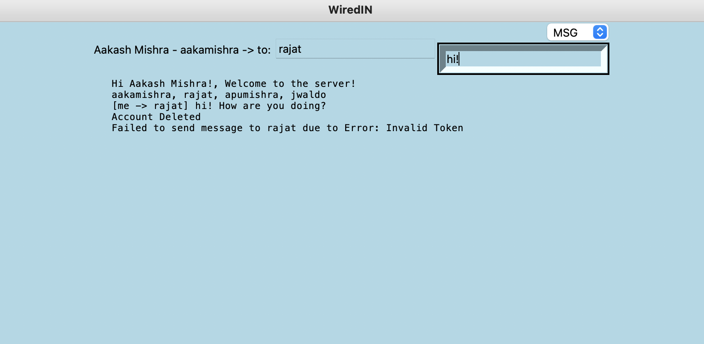

# cs262-wire-protocol: WiredIN

## A Socket-Based and GRPC Based Simple Account-Managed Chat Server. 

## Installation Instructions

Download the repository from Github.

```
git clone https://github.com/greenFantasy/cs262-wire-protocol.git
```

Click below for instructions on how to install the required modules.
[Python Module Installation](docs/install.md)

## Design Document

Below is our Chat Server design document.

[Chat Server Design](docs/design_main.md)

## Engineering Notebook

Below is the notebook we used to keep track of our notes.

[Engineering Notebook](docs/notebook.md)

## Unit Testing Documentation

Below is the documentation for our unit tests.

[Unit Testing](docs/testing.md)

## Running the Client

Once the server is running, pull up the networking profile of the host machine and add the local ip address to line 15 in `client.py` where `ADDRESS` is defined. An example comment there already specifies what this should look like. 



In order to run the server open a bash / terminal on your computer and simply invoke the following:

For GRPC.

```
python grpc_server.py
```

For Sockets.

```
python socket_server.py
```

In another bash / terminal window run `python client.py`.

The terminal prompt will ask you for (y/n) for GRPC. Please type in "y" and then <enter> if you activated the GRPC server, or "n" & <enter> if you activated the socket server.

If you have made an account before (as in within the instance of the server running) then please type in yes. However, if it is your first time booting up the client then enter no. 


Then enter your username:



You can then chose an appropriate password.


Finally add your name to complete the instance profile.



This will intialize the chat window for you as follows:



You can then search up users that you want to message using the `LIST` option and a regular expression in the box that says sample message. In order to send your query, press enter once you are done typing in that box. You will then see something like this:



You can then take the username of the person you would like to message and enter their username in the box that contains "Recipient Input". You can then type your message to them in the main box and press enter after selecting the `MSG` type. 



In order to delete your account, just select the delete type from the option bar and then press enter in the message bar. You should get a message like so. 



After you delete the account, all other actions will be void because the client token will be deregistered. Hence the following message:



Close the window and open a new one! Have fun!


